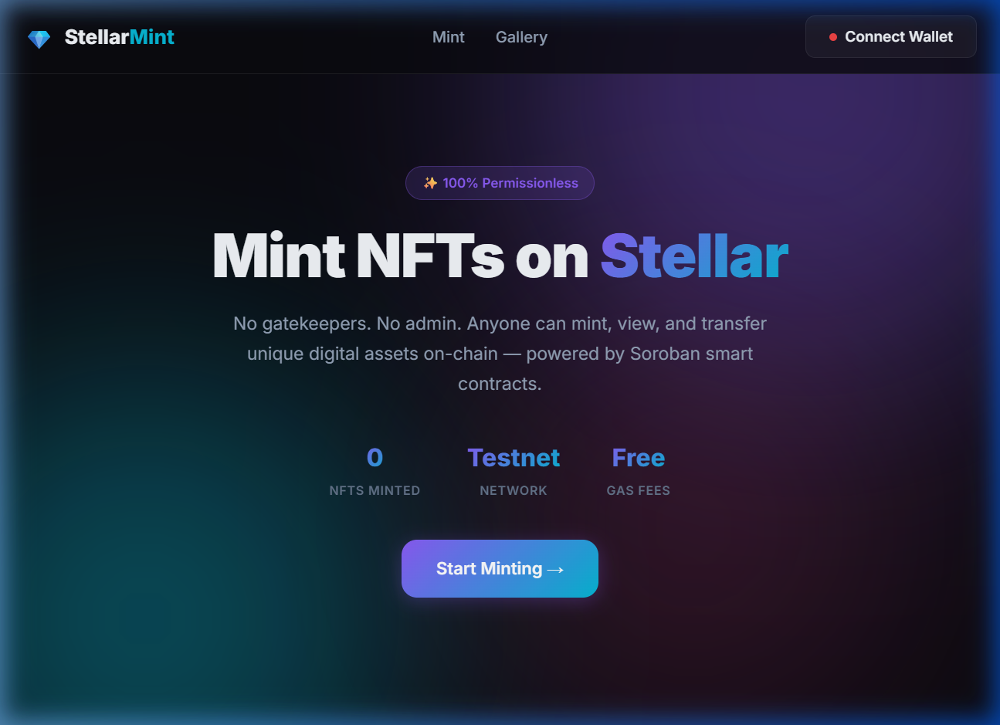
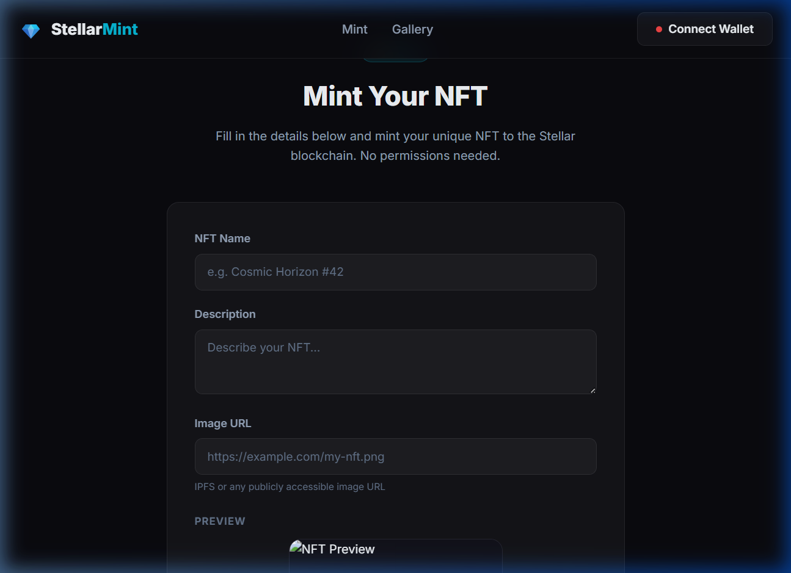
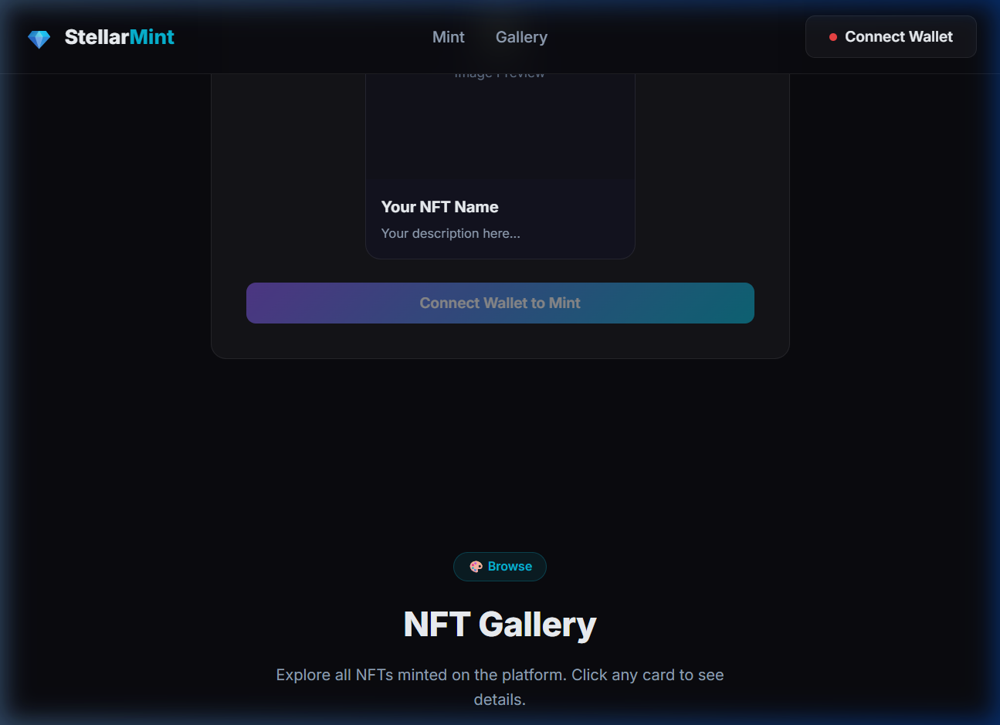

# 🚀 StellarMint — Permissionless NFT Minting Platform

## 📌 Project Description
A fully **permissionless** NFT minting platform built on **Stellar/Soroban**. Anyone can mint, view, and transfer unique digital assets on-chain — no admin roles, no gatekeepers, no initialization functions.

---

## ⚙️ Architecture

### Smart Contract (Soroban/Rust)
- **Auto-increment token IDs** — No collision risk, no duplicate checking needed
- **Rich metadata** — `String` type supports IPFS hashes, URLs, and long descriptions
- **NFT Struct** — Each NFT stores: `owner`, `name`, `description`, `image`
- **Persistent storage** — NFTs stored in persistent ledger entries

### Frontend (Vite + Vanilla JS)
- **Freighter wallet** integration for transaction signing
- **Full contract integration** via `@stellar/stellar-sdk`
- **Live preview** while composing your NFT
- **NFT Gallery** with dynamic card rendering
- **Transfer modal** for sending NFTs to other users
- **Premium dark theme** with glassmorphism and gradient animations

---

## ✨ Contract Functions

| Function | Permissioned? | Description |
|---|---|---|
| `mint(minter, name, description, image)` | ❌ Anyone | Mints NFT, returns auto-generated token_id |
| `transfer(from, to, token_id)` | ✅ Owner only | Transfers NFT (owner must sign) |
| `get_nft(token_id)` | ❌ Anyone | Returns full NFT details |
| `owner_of(token_id)` | ❌ Anyone | Returns owner address |
| `total_supply()` | ❌ Anyone | Returns total minted count |
| `list_all()` | ❌ Anyone | Returns all token IDs |

---

## 🛠 Tech Stack

- **Smart Contract:** Rust + Soroban SDK v25
- **Blockchain:** Stellar (Testnet)
- **Frontend:** Vite + Vanilla JavaScript
- **Wallet:** Freighter Browser Extension
- **SDK:** @stellar/stellar-sdk + @stellar/freighter-api

---

## 🚀 Getting Started

### Prerequisites
- [Rust](https://rustup.rs/) with `wasm32-unknown-unknown` target
- [Stellar CLI](https://soroban.stellar.org/docs/getting-started/setup)
- [Node.js](https://nodejs.org/) v18+
- [Freighter Wallet](https://www.freighter.app/) browser extension

### Build the Contract
```bash
cd contract
stellar contract build
```

### Run Contract Tests
```bash
cd contract
cargo test
```

### Deploy Contract (Testnet)
```bash
stellar contract deploy \
  --wasm target/wasm32-unknown-unknown/release/contract.wasm \
  --source your-key \
  --network testnet
```

### Run the Frontend
```bash
cd frontend
npm install
npm run dev
```

Then open http://localhost:5173 in your browser.

### Configure Contract Address
After deploying, update the `CONFIG.contractId` in `frontend/src/main.js` with your deployed contract address.

---

## 📷 Screenshots

### Hero Section


### Mint Form


### NFT Gallery


---

## 📄 License
MIT
